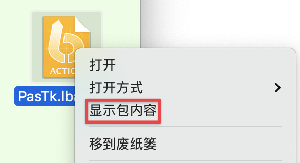
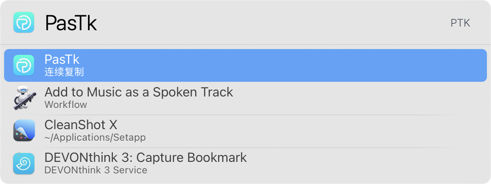

<div align="center"></div>

<p align="center">
	<a href="https://www.python.org">
		
	</a>
	<a href="https://github.com/PySimpleGUI/PySimpleGUI.git">
		
	</a>
	<a href="https://www.codefactor.io/repository/github/lambolalee/pastk">
		
	</a>
    <a href="https://github.com/LambolAlee/PasTk/actions/workflows/python-app-Windows.yml">
		
	</a>
    <a href="https://raw.githubusercontent.com/LambolAlee/PasTk/main/LICENSE">
		
	</a>
    
</p>
<p align=center>
    <a href="README.md">English</a> | <b>中文</b>
    <br/>
	mac上的连续复制
    <br/>
    <b>By Lambol.Michael.Alee</b>
</p>

## 目录

- [介绍](#介绍)
- [安装](#安装)
    - [Windows 用户](#windows-用户)
    - [macOS 用户](#macos-用户)
        <br/>&emsp;&emsp;[通过LaunchBar使用](#通过launchbar使用)
    - [Linux 用户](#linux-用户)
- [构建](#构建)
    - [从源码构建](#从源码构建)
- [使用](#使用)
    - [教程](#教程)
    - [连续复制](#连续复制)
    - [管理复制的文本](#管理复制的文本)
    - [设置面板](#设置面板)
    - [多种粘贴模式](#多种粘贴模式)
- [感谢](#感谢)
- [链接](#链接)
- [许可](#许可)

## 介绍

今年中旬，我换了台苹果电脑作为主力机使用。作为一个荣耀的医学生，需要一个工具来帮助我复制粘贴许多文字到医学笔记中。此前，我使用 [Quicker](https://getquicker.net) 来简化这一操作，如今却没有找到类似的替代工具（当然很大可能性是我没找到）。虽然知道有很多非常优秀的剪贴板管理软件例如 [Paste](https://pasteapp.io)。这是我非常喜欢的一款软件，它可以复制非常多类型的内容到临时的剪贴板里，来供我选取调用，也有stack paste 模式来按顺序的粘贴（类似于选择粘贴模式）但是相比于连续复制，其实对于做笔记来说更需要的是后者，所以我决定自己写一个工具。于是就诞生了PasTk。

## 安装

（本项目目前尚未推出正式版本）

### Windows 用户

 [](https://github.com/LambolAlee/PasTk/actions/workflows/python-app-Windows.yml)

本项目部署了[Github Action](https://github.com/LambolAlee/PasTk/actions/workflows/python-app-Windows.yml) 有兴趣使用的用户可以到Action生成的artifact下找到可以使用的软件。

### macOS 用户

<p>
	<a href="https://github.com/LambolAlee/PasTk/actions/workflows/python-app-macOS.yml">
		
	</a>
	
</p>

（*在打包的时候遇到了一个狠迷人的问题，详情可移步 [issue]()*）

虽然现在mac平台上打包问题还没有解决，但是也有另外的方式可以使用这个软件，而且可能会更加方便，对于直接双击运行来说。使用macOS 启动器，比如说大名鼎鼎的 [LaunchBar](https://www.obdev.at/products/launchbar/index.html) 和 [Alfred](https://www.alfredapp.com) 或者是其他任何有类似功能的软件。

#### 通过LaunchBar使用

- **步骤一**

  按下 <kbd>command</kbd> + <kbd>space</kbd> 快捷键唤醒LaunchBar的输入条，然后输入AE来打开LaunchBar的动作编辑器

  

- **步骤二**

  点击右下角的加号，来新增一个自定义动作

  

- **步骤三**

  填写动作图标和动作名称（**必填项**，例如 PasTk）其他项目根据喜好选填

  *上图中的图标在[这里](https://github.com/LambolAlee/PasTk/tree/main/resources/logo)*

- **步骤四**

  切换到 Scripts 选项卡，选择语言为 Python，并修改文件名为main.py，同时只勾选在后台运行

  

- **步骤五**

  1. 右击新建到动作，选择在访达中显示

     

  2. 右键新建的动作文件，选择显示包内容

     

- **步骤六**

  将下载好的源代码放到`PasTk.lbaction/Contents/Scripts`文件夹中，自选的图标文件可以放到`PasTk.lbaction/Contents/Resources` 文件夹里

  ***注意点：*** *LaunchBar会自动调用系统Python，所以还需要手动在main.py的第一行加上shebang字符串明确指定Python解释器*

  

- **步骤七**

  唤醒LaunchBar并输入<kbd>ptk</kbd>，就可以运行PasTk了:+1:（当然你也可以为这个动作设置快捷键）

  

### Linux 用户


我没有运行Linux的电脑然后我也很久很久没有用过Linux了。希望能早日支持:pray:

## 构建

### 从源码构建

克隆这个仓库：

```bash
git clone https://github.com/LambolAlee/PasTk.git
```

安装依赖项：

```bash
pip install -r requirements.txt
```

运行程序：

```bash
python main.py
```

## 使用

### 教程

1. 首先启动软件然后点击开始按钮

2. 复制所有你需要用到的文本

3. 点击结束按钮结束复制然后选择需要的粘贴模式

4. **<u>*注意点：*</u>** 事先点一下待粘贴的位置，然后再进行后续操作

   

5. 使用合适的粘贴模式进行粘贴

   *如果软件自动粘贴失败，仍然可以手动进行粘贴，因为在尝试自动粘贴之前，软件已经将文字写入剪贴板*

6. 恭喜🎉操作完成

### 连续复制

你可以一直进行复制，复制的文本会被收集到一起以便后续使用


界面介绍：

- :one: 已经复制的数量
- :two: 详情页面，在那里你可以管理所有已经复制下来的文本
- :three: 设置面板
- :four: 开始或结束按钮
- :five: 重置按钮


### 管理复制的文本

点击右上角的图标就可以进入这个管理界面


在这个窗口中你可以：

- 增加或去除文本
- 在右侧的文本框中你可以修改复制的文本

### 设置面板

有如下设置项：

- 管理所有有关音乐的设置项

  - 启动音乐：软件启动时候的音乐
  - 结束音乐：按下结束按钮且临时剪贴库中有内容时会播放
  - 粘贴音乐：每次成功复制时播放

- 一次性模式和持续运行模式

  - 一次性模式：一旦程序运行完一个完整流程，就会自动退出

- 音乐相关的文件均存放在资源文件夹中，你可以点击播放按钮来试听每一种音效，当然你也可以添加自己的音乐

  （***目前只支持mp3和wav格式的音乐***）


### 多种粘贴模式

选择粘贴模式窗口的截屏


- 合并粘贴：使用连接符来连接所有的文本（默认""空字符串）

  
  

- 分段粘贴：使用换行符或制表符来连接所有文本（默认换行符）

  


- 连续粘贴：通过点击粘贴的按钮来有序可控地粘贴文本（遵循先进先出的顺序）

  


- 选择粘贴模式：以列表的形式呈现所有待粘贴的选项，可以有选择地粘贴

  

## 感谢

匿名同学（他制作了好听的[启动音乐](https://github.com/LambolAlee/PasTk/tree/main/resources/musics/launch)）

## 链接

- [连续复制5.0](https://getquicker.net/Sharedaction?code=a8ead7b7-0dfb-49b8-c1e2-08d6a4fe0b4a)

- [爱给网](https://www.aigei.com/)

- [站长素材网](https://sc.chinaz.com/yinxiao/)

## 许可

PasTk 以 [GPLv3 ](LICENSE)许可证发布
